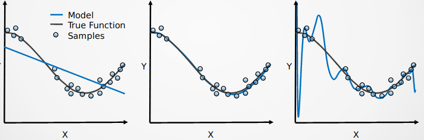
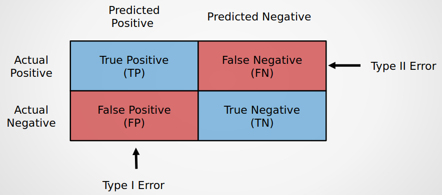
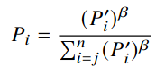

## Supervised Learning
The supervised learning used to label training data. 
Examples: 
- Classification(KNN algorithm, Support Vector Machine)
- Regression (Linear Regression, Lasso, Ridge)
- Neural Networks (Convolutional Neural Network)

### Data Type
The raw data consists of these few types:
1. **Discrete**: The discrete data only take certain values. Like throwing a dice, you obtained only 1,2,...,6. These 
integers are discrete.
2. **Continuous**: These data are continuous and can have any real values within an interval.
3. **Ordinal**: You cannot compare such ordinal data. For instance, gender, street name, etc.
4. **Nominal**: Nominal data allowed you to rank their numerical values. Example: exam ranking.
5. **Interval**: In interval data, the zero value has its own meaning. For instance, 0 degree celsius 
doesn't implies no temperature exists. It just used to differentiate whether temperature values 
are positive or negative.

4. Ratio: In ratio data, the zero values doesn't contain any meaning. For instance, when someone 
getting 0% in a test, and his marks really contain nothing.

### Overfitting, Underfitting



The **underfitting** (The left one) occured when your data is poorly trained (You can observed that the fitting curve is linear), 
and this implies that your model do not "learn" enough. The bias for underfitting is higher, but it has a lower variance.

When you run an **overfitting model** (the right figure), your error (distance from each point to the line) will become 
smaller with more iterations. This is because your fitting curve almost connect up every single 
point of the data (Our task is fitting a model, not connect them together). The bias for underfitting is lower, but it has a higher variance.

You can check the cross validate scores of your model. If your tested scores is around 75-80, then it is a right fitting model. 
Otherwise, if the cross validate scores is **extremely high (99-100 percent)**, then this considered as overfitting.

### Data Transformation

**Standard Scaler**
> Please take note that you cannot directly applied
> `sklearn.preprocessing` on 1D-array (like assignment 2 Q2). You need to define your 
> own methods for scaling.
```python
import numpy as np

def standard_scaler(data):
  # data is array type
  mu = np.mean(data)
  std = np.std(data, ddof=1)
  for val in data:
    print((val - mu) / std)
```

**MinMax Scaler**
```python
import numpy as np

def minmax_scaler(data):
  # data is array type
  max_value = np.max(data)
  min_value = np.min(data)
  for val in data:
    print((val - min_value) / (max_value - min_value))
```

**Max Absolute Scaler**
```python
import numpy as np

def max_abs_scaler(data):
  # data is array type
  max_value = np.max(np.abs(data))
  print(data / max_value)
```

**Robust Scaler**
```python
import numpy as np

def robust_scaler(data):
  # data is array type
  q1 = np.percentile(data, 25)
  q2 = np.percentile(data, 50)
  q3 = np.percentile(data, 75)
  for val in data:
    print((val - q2) / (q3 - q1))
```

**One-hot encoding**: Convert your data into binary values. Data type: `int`, `bool`

**Ordinal encoding**: Convert your data into ordinal integers. 
Data type: `int`, `char` (Char is 1 byte = 8 bits, you can use `Char` if number of classes is less than 8) 

**Logistic Regression**

> Logistic Regression **is not really about regression**. Instead, it is a classification,
> and also a binary classifier.

### Confusion Matrix

Confusion matrix used to visualize the number of true positive (TP), 
true negative (TN), false positive (FP) and false negative (FN). 



> If we predicted someone being infected by virus, and he really is, then 
> this is consider as TP. If we predicted he is healthy and he isn't infected,
> then this is TN.

On the other hand, if we wrongly predicted, for instance,

> If the test subject is healthy but we wrongly predicted him an infected, then 
> this situation is called FP. 

The type I and type II errors are not only occured test of hypotheses in statistics. 
They can be occured when performing A/B testing (or split-run testing). A/B testing 
usually applied in marketing or digital products (Mobile apps UI design, apps features, etc.).
It tests randomly on two customers A and B, then we compare their experience.

### ROC Curve, AUC Curve

The ROC curve defined how good is your model. If your tested score is above the diagonal line, 
then yours should be a robust model.

The AUC denotes the area under ROC curve. Its area described how accurate is your True Positive.

## Unsupervised Learning
The different between unsupervised learning and supervised learning is: supervised learning consists 
of labeled training data and some training examples, which the pattern has been determined. For 
unsupervised learning, we are given the clusters (or group), but the tested data has unidentified 
pattern. 

Examples: 
- Clustering (K Means, mixture models)

### Dimensionality Reduction
To prevent the **curse of dimensionality**, you should eliminate the unwanted features. The cost 
for training dataset will increase exponentially akin to the number of features. We can manually
select the features that are highly correlated or applied **principle component analysis (PCA)** 
on dataset.

## Genetic Algorithm
Generally, the genetic algorithm involved 3 operations: **crossover**, **mutation**, and **selection**.
1. crossover: Swapping two chromosomes (bit-array) randomly.
2. mutation: Flipping the value in gene. For instance: 101 -> 010
3. selection: we choose the best solution and inherits to next step.

Once finished the three operations above, the process will repeat again until the iterations over.

In fact, GA algorithm has been depreciated since it cannot effectively solve problem.
For instance, you'll found that no hill to climb in **gradient descent**. Even the random 
tree search algorithm is faster than GA!

**Historical fact:** The 2006 NASA ST5 spacecraft has adopted GA algorithm to create 
the best radiation pattern for [evolved antenna](https://en.wikipedia.org/wiki/Evolved_antenna).

### Selection Pressure

The fitness function is defined as below:



Given that:

> P1'=0.05, P2'=0.11, P3'=0.12, P4'=0.24, P5'=0.48, and beta=0.5.

Use the fitness function above, find P1, P2, P3, P4, and P5.

> ANSWER: P1=0.1073, P2=0.1591, P3=0.1662, P4=0.2350, P5=0.3324 (total sum=1).

## Neural Network
The neural network has 3 layers: **Input layer**, **Hidden layer**, **Output layer**.

You might heard of "black box". The hidden layer is also similar to it. 
The Convolutional Neural Network (CNN) uses multiple hidden layers (or perceptrons).
Inside these hidden layers, it perform [sliding dot products](https://en.wikipedia.org/wiki/Cross-correlation) to 
tensors input.

### Training Process
The "training" mentioned that the weights are adjusted to 
more accurate output, and the process that adjust these 
weights is known as **backpropagation**. 

## Conclusion: Shameless Plug
In my own opinion: FA calculations might be: (They are easier for calculation)
- Confusion matrix (Accuracy score, specificity, etc.)
- Selection Pressure
- Neural Network

(I didn't prepare much, since the FA is similar to assignment 2)